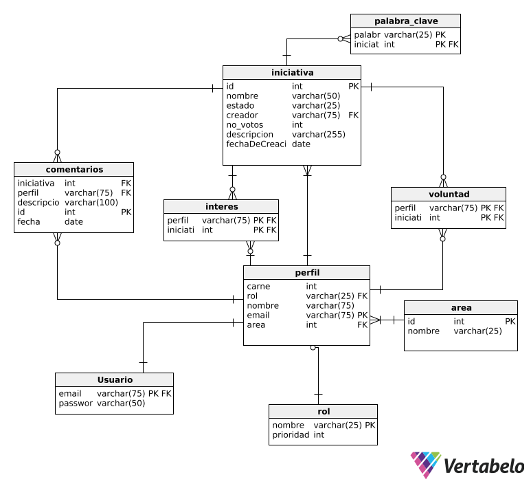
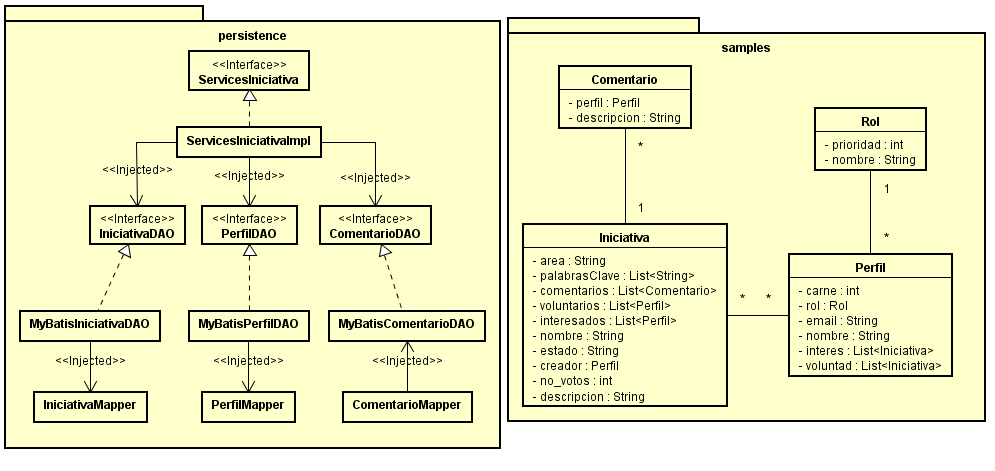

## Escuela Colombiana de Ingeniería
## Procesos de desarrollo de Software – PDSW
## BANCO DE INICIATIVAS DE PROYECTOS - 2018-2

La Plataforma banco de iniciativas de proyectos, es una herramienta donde la comunidad universitaria de la Escuela Colombiana de Ingeniería Julio Garavito pueden registrar sus iniciativas e ideas de proyectos para ser desarrollados o gestionados por la PMO de la Escuela. El sistema, más allá de facilitar el registro de las iniciativas e ideas de proyectos, es una valiosa base de conocimiento donde los diferentes actores pueden revisar si hay iniciativas, ideas o intereses similares y aunar esfuerzos para la materialización. Adicional a lo anterior, el personal académico puede integrar a los estudiantes de diferentes asignaturas o proyectos de grado para su realización, materializando las iniciativas para el beneficio de toda la comunidad universitaria. La PMO puede priorizar las iniciativas viables, asignar responsables, gestionar la asignación de recursos, llevar métricas e identificar grupos de interés -a través del tiempo- que se van presentando para cada iniciativa. Con esto se espera lograr no solo la realización de los proyectos sino una aplicación práctica de los conocimientos adquiridos por los estudiantes dentro de las asignaturas de la Escuela generando un ambiente de aprendizaje colaborativo.

## Integrantes
* Jeymar Vega Bustos - Equipo de desarrollo
* Luis Eduardo Moreno Acevedo - Equipo de desarrollo
* Michael Sebastian Preciado Garzon - Scrum master, Equipo de desarollo
### Profesor
* Francisco Chavez (Product owner)
* Santiago Alzate 

# Detalles provistos por el Stakeholder.

El objetivo del sistema es permitir el registro y seguimiento de las iniciativas e ideas de proyectos que han sido propuestas por la comunidad universitaria de la Escuela. El banco de iniciativas debe contar con una interfaz de usuario bonita y amigable con los usuarios.
 
Tipos de usuario:
 
Administrador
 
Personal PMO
 
Proponente
 
Publico
 
 
Administrador:
Modificar el Estado de las ideas o iniciativas.
Agrupamiento de las ideas o iniciativas equivalentes o relacionadas.
Asignación de perfiles.

Personal PMO:
Consultar las iniciativas o ideas de proyectos que los proponentes han publicado.
Cambiar el estado de las iniciativas.
	
	
Estado de la Iniciativa
1 En espera de revisión
2 En revisión
3 Proyecto
4 Solucionado

Proponente:
Registrar de una iniciativa o idea: Importante guardar la referencia a los datos del usuario para poder ser contactados, incluyendo su área o dependencia.
Consultar las ideas o iniciativas que el proponente ha realizado
Modificar una iniciativa o idea siempre y cuando se encuentre en el estado “propuesta”.
 
Público:
Consultar la información de las diferentes ideas o iniciativas 
Poder mostrar su interés o afinidad con el desarrollo de una idea o iniciativa de proyecto que se encuentre en el banco y dejar comentarios u observaciones al mismo. 
Votar (dar like) sobre una idea o iniciativa.
Indicar la intención de trabajar o apoyar el desarrollo de la iniciativa o idea de proyecto, es decir, que le interesa
Consultar las ideas o iniciativas de acuerdo a palabras clave
Entregar estadísticas con base en la información registrada.
 
Administrador:
Consulta de toda la información relacionada con las ideas o iniciativas. Permitir hacer la consulta de las ideas o iniciativas por áreas, dependencia, palabras clave.
Incorporar al informe diferentes estadísticas.
* Porcentaje de ideas de las diferentes áreas o dependencias.
* Cantidad de proyectos relacionados por cada uno de los estados.

Todas las consultas deben tener al menos la siguiente información: Id, nombre de la iniciativa, el estado, el número de votos, el nombre, el usuario y el email del proponente, el área o dependencia, la fecha de creación de la iniciativa.
# Arquitectura y diseño
## Modelo E-R

## Modelo de clases

## Tecnologías utilizadas
* PrimeFaces
* MyBATIS
* Postgresql
* Guice
* Bootstrap
* Google chart

## Aplicación
https://iniciativaseci.herokuapp.com/

# Descripción del proceso
## Metologia
Se utilizó la metodología SCRUM.
## Trello
https://trello.com/b/FtoJPwHo/2018-2-proypdsw
